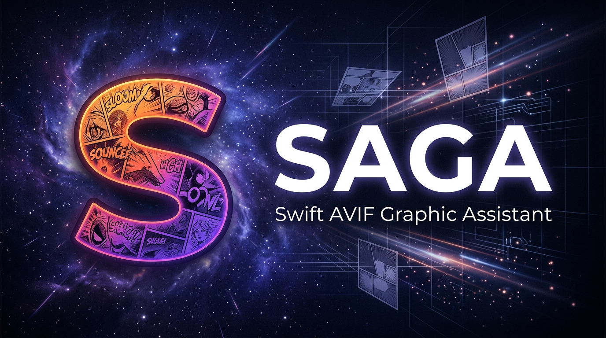

# SAGA (Swift AVIF Graphic Assistant)



SAGA is a lightweight desktop application that leverages macOS 13 Ventura and later native features (SwiftUI / Combine / AppKit) to browse AVIF image files in a local folder with a layout optimized for reading comics.

---

## 1. Operating Environment
- **OS**: macOS 13.0 (Ventura) or later
- **Language/Tools**: Swift 5.9 or later (Xcode 15 or later recommended)

---

## 2. Key Features

- **Asynchronous Folder Scanning**: 
  Extracts only files with the `.avif` extension (case-insensitive) from a specified folder. The file retrieval process runs asynchronously on a background thread, preventing the UI from freezing even with large numbers of files.
- **Natural Order Sorting**: 
  The extracted files are indexed and sorted in natural order (e.g., `2.avif` comes before `10.avif` using `localizedStandardCompare(_:)`) based on their filenames.
- **Flexible Display Modes**: 
  - **Layout**: Switch between "Single Page" and "Two Pages" (spread).
  - **Reading Direction (Page Flow)**: 
    - `Right to Left (RTL)`: Japanese comic style. Lower index images are placed on the "right" side.
    - `Left to Right (LTR)`: Western book style. Lower index images are placed on the "left" side.
  - **Show Cover Page (showsCoverPage)**: 
    When in "Two Pages" mode, this option displays the first page (cover) as a single page, and subsequent pages in spreads of two.
- **Keyboard Navigation**: 
  Use the Left and Right Arrow keys to navigate between pages. Keyboard behavior dynamically reverses based on the Reading Direction setting (RTL/LTR).
- **Asynchronous Image Loading & Memory Caching**: 
  `SagaImageLoader` loads images asynchronously and caches them in memory using `NSCache`, providing smooth and fast rendering performance.

---

## 3. Core Implementation Details & Algorithms

The core implementation logic in `SagaCore` operates as follows:

### 3.1 Automatic Pointer Validation (`validatePointer`)
Automatically called when the base display index (`pointer`) or layout settings change to prevent inconsistent states.
- **Range Boundary**: `pointer` is constrained to `0` to `maxIndex` (total images - 1). It resets to `0` if no images are available.
- **Spread Parity Adjustment in Two Pages Mode**:
  - **When `showsCoverPage` is `true`**:
    - `pointer` is adjusted to `0` or an odd number (`1, 3, 5...`). If `pointer` is an even number greater than 0, it is corrected to the next odd number (`pointer + 1` if within bounds, otherwise `pointer - 1`).
    - *Note: This ensures that when `showsCoverPage` is active, index `0` (the first image) is displayed alone, and subsequent pages are displayed as spreads starting from index `1`.*
  - **When `showsCoverPage` is `false`**:
    - `pointer` is always adjusted to an **even** number (`0, 2, 4...`). If odd, it is corrected to `pointer - 1`.

### 3.2 Image Mapping Logic (`calculateDisplayIndices`)
Determines which image indices `(left, right)` should be drawn on the screen based on the current `pointer`, `displayCount`, and `pageDirection`. If only one index is present, it is centered; if both are present, they are displayed side-by-side.
- **Single Page Mode (`displayCount == 1`)**:
  - `pageDirection == .ltr`: `(left: pointer, right: nil)`
  - `pageDirection == .rtl`: `(left: nil, right: pointer)`
- **Two Pages Mode (`displayCount == 2`)**:
  - When `showsCoverPage` is `true` and `pointer == 0`:
    - Only the first image (index `0`) is displayed (centered).
  - Otherwise:
    - Pairs the base index `first = pointer` with the next index `second = pointer + 1` (if it exists).
    - `pageDirection == .rtl` (Right to Left): `(left: second, right: first)` (lower index on the right)
    - `pageDirection == .ltr` (Left to Right): `(left: first, right: second)` (lower index on the left)

### 3.3 Page Navigation Calculation
- **Navigation Step Size**:
  - In Single Page mode, moves by `1` page.
  - In Two Pages mode, moves by `2` pages, except when navigating between `0 ↔ 1` while `showsCoverPage` is `true` (step size becomes `1`).
- **Key Actions and Transitions**:
  | Reading Direction | Press Key | Pointer Adjustment | Visual Effect |
  | --- | --- | --- | --- |
  | **Right to Left (RTL)** | `Left Arrow (←)` | Increase pointer (`+step`) | Advance to next page (left) |
  | | `Right Arrow (→)` | Decrease pointer (`-step`) | Return to previous page (right) |
  | **Left to Right (LTR)** | `Right Arrow (→)` | Increase pointer (`+step`) | Advance to next page (right) |
  | | `Left Arrow (←)` | Decrease pointer (`-step`) | Return to previous page (left) |

---

## 4. Project Structure

```
.
├── Package.swift            # Swift Package Manager configuration
├── spec.md                  # Design specifications (may differ slightly from implementation)
├── README.md                # This file
└── Sources/
    ├── SagaCore/            # Application domain logic (UI-independent)
    │   ├── SagaCore.swift
    │   ├── SagaImageLoader.swift # Image loading & cache management
    │   └── SagaViewerState.swift # State management & algorithms
    ├── Saga/                # Main application (SwiftUI UI layer)
    │   ├── main.swift       # Entry point
    │   └── ContentView.swift # Main window layout & key event monitoring
    └── SagaTests/           # Core logic unit tests
        └── main.swift
```

---

## 5. Build and Run

You can build and run the application from the terminal using Swift Package Manager.

### Running the Application
```bash
swift run Saga
```

### Running Tests
Run the unit tests targeting `SagaCore` logic.
```bash
swift run SagaTests
```